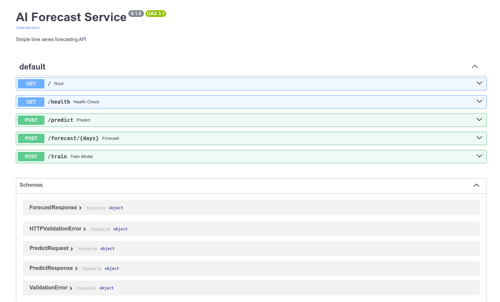

# K8s AI Forecasting System

Distributed AI forecasting system from local Kubernetes to AWS cloud

## 🎯 Project Status

**V1.1 - Kubernetes Deployment** ✅ (2025-12-02)

Service successfully deployed to Kubernetes using Docker Hub image. All core functionality validated.

## 📁 Project Structure

```
k8s-kxs/
├── app/                   # Application code
│   ├── main.py           # FastAPI main application
│   ├── models.py         # ML models
│   └── schemas.py        # Data models
├── k8s/                  # Kubernetes resources
│   ├── namespace.yaml
│   ├── deployment.yaml
│   └── service.yaml
├── scripts/              # Container management scripts
│   ├── docker-run.sh    # Start/restart container
│   ├── docker-stop.sh   # Stop container
│   ├── docker-logs.sh   # View logs
│   └── docker-restart.sh # Restart container
├── tests/                # Tests
├── Dockerfile            # Container image
├── requirements.txt      # Python dependencies
├── test-mvp.sh          # MVP test script
└── README.md
```

## 🚀 Quick Start

### Prerequisites

- Docker Desktop (with Kubernetes enabled)
- Python 3.9+
- kubectl (Kubernetes CLI)
- curl / jq (for testing)

### Deploy to Kubernetes (Current - V1.1)

```bash
# 1. Apply K8s resources
kubectl apply -f k8s/

# 2. Check deployment status
kubectl get pods -n ai-forecast

# 3. Port forward to access service (required for Docker Desktop)
kubectl port-forward -n ai-forecast service/ai-forecast 8080:8000

# 4. Test service (in another terminal)
./test-mvp.sh

# 5. Access API docs
open http://localhost:8080/docs
```

### Run with Docker (Legacy - MVP)

**For local development without Kubernetes:**

**Method 1: Using Helper Scripts (Recommended)**

```bash
# Start service (builds and runs)
./scripts/docker-run.sh

# Start with rebuild
./scripts/docker-run.sh --build

# Test service
./test-mvp.sh

# View logs
./scripts/docker-logs.sh

# Restart service
./scripts/docker-restart.sh

# Stop service
./scripts/docker-stop.sh
```

**Method 2: Manual Docker Commands**

```bash
# Build image
docker build -t ai-forecast:v1 .

# Run service
docker run -d -p 8080:8000 --name ai-forecast-mvp ai-forecast:v1

# Test service
./test-mvp.sh

# Manual API testing
curl http://localhost:8080/health
curl -X POST http://localhost:8080/train
curl -X POST http://localhost:8080/predict \
  -H "Content-Type: application/json" \
  -d '{"data": [10, 20, 30, 40, 50]}'

# Access API documentation
open http://localhost:8080/docs

# Stop and remove
docker stop ai-forecast-mvp
docker rm ai-forecast-mvp
```

## 📊 Core Features

- ✅ **Health Check**: `GET /health`
- ✅ **Model Training**: `POST /train`
- ✅ **Single Prediction**: `POST /predict`
- ✅ **Multi-step Forecast**: `POST /forecast/{days}`
- ✅ **API Documentation**: `/docs` (Swagger UI)

### API Documentation (Swagger UI)



The service provides a complete OpenAPI/Swagger interface with:
- **5 Endpoints**: Root, Health Check, Predict, Forecast, Train
- **5 Schema Models**: Request/Response validation with Pydantic
- **Interactive Testing**: Try out API calls directly from the browser

## 🛠 Tech Stack

### Current (MVP)
- **Backend**: FastAPI + Python 3.9
- **ML**: scikit-learn (LinearRegression)
- **Container**: Docker
- **API Documentation**: Swagger / OpenAPI

### Planned
- **Orchestration**: Kubernetes + Helm
- **Distributed Computing**: Ray
- **Monitoring**: Prometheus + Grafana
- **Frontend**: React / Vue
- **Cloud Platform**: AWS EKS

## 📈 Development Roadmap

### ✅ Completed
- [x] Project planning and architecture design
- [x] FastAPI service development
- [x] ML model implementation
- [x] Docker containerization
- [x] MVP functionality validation
- [x] Docker Hub image publishing
- [x] Kubernetes deployment (V1.1)

### 📋 Planned
- V1.1: K8s deployment refinement
- V1.2: Helm Chart packaging
- V1.3: Ingress configuration
- V1.4: Monitoring and logging
- V1.5: Improved ML models (Prophet/LSTM)
- V2.0: Ray distributed computing
- V2.1: Frontend dashboard
- V3.0: AWS EKS deployment

See [mvp-next-steps.md](docs/mvp-next-steps.md) for details

## 📚 Documentation

- [Project Overview](docs/project.md) - Project background and goals (Chinese)
- [Implementation Plan](docs/implementation-plan.md) - Complete technical implementation plan
- [MVP Plan](docs/mvp-plan.md) - MVP detailed steps
- [MVP Deployment Summary](docs/mvp-deployment-summary.md) - MVP completion status
- [K8s Deployment Complete](docs/k8s-deployment-complete.md) - V1.1 Kubernetes deployment guide ✅ NEW
- [Next Steps](docs/mvp-next-steps.md) - Follow-up iteration plan

## 🔍 Known Issues & Troubleshooting

### Container Name Conflict

**Issue**: `Error response from daemon: Conflict. The container name "/ai-forecast-mvp" is already in use`

**Solution**: Use the helper scripts which automatically handle cleanup:
```bash
./scripts/docker-run.sh
```

Or manually remove the existing container:
```bash
docker rm -f ai-forecast-mvp
```

### Docker Login Credential Storage Error

**Issue**: `Error saving credentials - err: exit status 1, out: gpg: Unusable public key`

**Cause**: GPG-based credential helper conflict with Docker Desktop

**Solution 1 (Recommended)**: Use Docker Desktop's built-in credential store
- Docker Desktop should handle this automatically
- If error persists, try restarting Docker Desktop

**Solution 2 (Workaround)**: Skip credential storage for local development
```bash
# Login with --password-stdin to avoid interactive prompt
echo "YOUR_PASSWORD" | docker login -u jindaxz --password-stdin
```

**Note**: For this MVP, you don't need to push images to Docker Hub unless deploying to production. Local development works fine without login.

### K8s Multi-node Image Distribution

**Issue**: Unable to properly distribute local images in Docker Desktop Kubernetes multi-node environment

**Temporary Solution**: Use Docker directly (MVP validated)

**Permanent Solutions**: Choose one of the following
1. Use Kind cluster (recommended)
2. Push images to Docker Hub
3. Configure local Registry

See [mvp-next-steps.md](docs/mvp-next-steps.md) for details

## 🎓 Learning Resources

### Kubernetes
- [Official Documentation](https://kubernetes.io/docs/)
- [Training Repository](https://github.com/jasonumiker/kubernetes-training)
- [Kind Documentation](https://kind.sigs.k8s.io/)

### Ray
- [Ray Documentation](https://docs.ray.io/)
- [Ray on K8s](https://docs.ray.io/en/latest/cluster/kubernetes/index.html)

### FastAPI
- [Official Documentation](https://fastapi.tiangolo.com/)

## 🤝 Contributing

This is a learning project, suggestions for improvements are welcome!

## 📝 License

MIT License

---

**Project Start Date**: 2025-11-28
**MVP Completion Date**: 2025-11-28
**K8s Deployment Date**: 2025-12-02
**Current Version**: v1.1 (Kubernetes)
